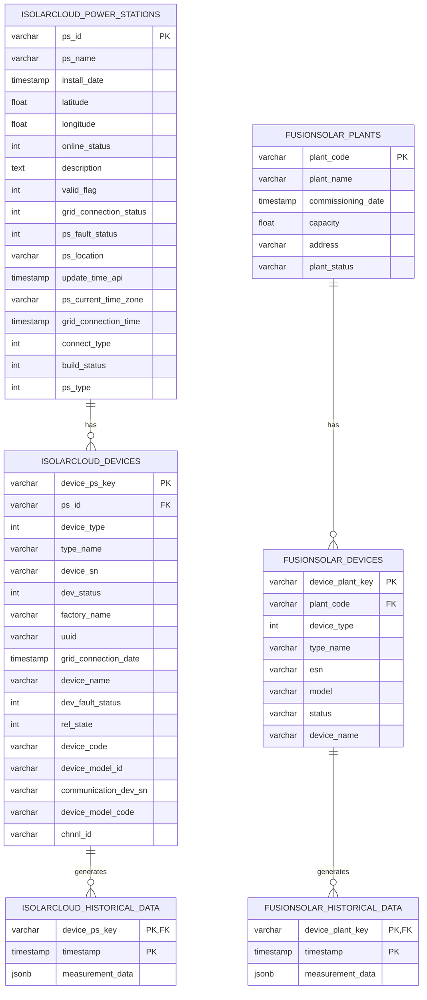
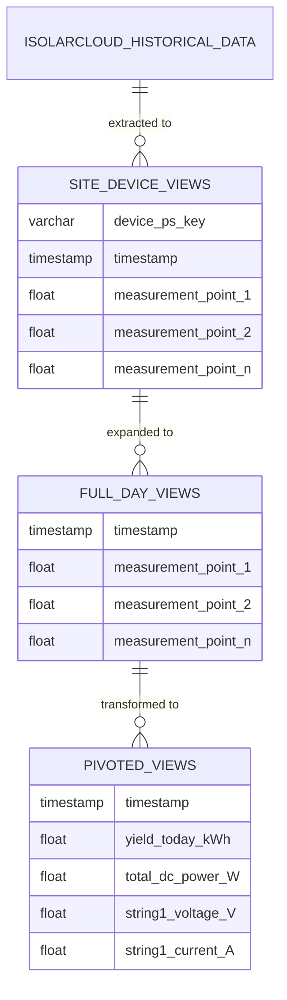

# Entity Relationship Diagram (ERD)

## Database Schema Design

This document provides a detailed Entity Relationship Diagram for the Solar Monitoring System Database.

## Core Entities



## Derived Views

The system creates multiple SQL views for easier data analysis:



## Device Type Classification

Devices are classified into different types:

1. **Inverters (Type 1)**:
   - String-level measurements
   - Summary measurements (Yield, DC Power, Active Power, Reactive Power)

2. **Meters (Type 5)**:
   - Energy measurements
   - Power quality metrics

3. **Meteo Stations (Type 14)**:
   - Irradiance
   - Temperature
   - Other environmental metrics

## Measurement Data Structure

The `measurement_data` JSON column in historical data tables follows this structure:

```json
{
  "p1": 123.45,  // Yield Today (kWh)
  "p14": 5000,   // Total DC Power (W)
  "p24": 4800,   // Total Active Power (W)
  "p25": 300,    // Total Reactive Power (var)
  "p101": 600,   // String 1 Voltage (V)
  "p201": 8.5,   // String 1 Current (A)
  // Additional measurement points...
}
```

Different device types have different sets of measurement points, as defined in the `ISOLARCLOUD_SITE_MEASURING_POINTS` and similar configuration dictionaries.
