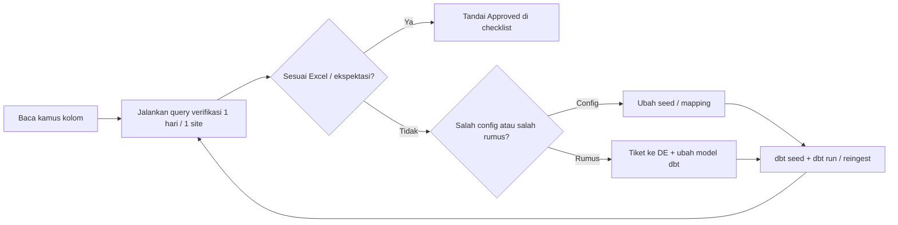
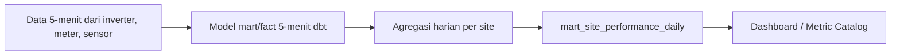
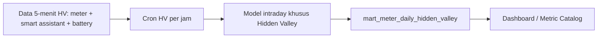

# Kamus Data MMSR — Panduan untuk User & Data Engineer

Dokumen ini menjawab: **kolom apa ini, dari mana, rumusnya, bagaimana mengecek, dan di mana mengoreksi jika salah.**

Tanpa kamus terstruktur, hanya data engineer yang memahami SQL dbt (contoh: `energy_a_kpi_daily_mwh` / "a_KPI").

---

## 1. Prinsip sajian (untuk semua tabel)

Setiap kolom mart/fact yang dipakai bisnis **wajib** punya entri dengan field berikut:

| Field                   | Isi                           | Contoh                                                                              |
| ----------------------- | ----------------------------- | ----------------------------------------------------------------------------------- |
| **Kolom DB**            | Nama persis di PostgreSQL     | `energy_a_kpi_daily_mwh`                                                            |
| **Nama tampilan**       | Label untuk Excel / Power BI  | "KPI Adjusted Harian (MWh)"                                                         |
| **Definisi bisnis**     | Satu kalimat untuk non-teknis | "Target energi harian yang diskalakan agar selaras dengan KPI bulanan operasional." |
| **Rumus**               | Notasi matematika + unit      | `target_harian × (KPI_bulan / simulasi_bulan)`                                      |
| **Sumber data (trail)** | Urutan tabel/seed             | `seed_daily_kpi_monthly` → `mart_site_kpi_monthly` → JOIN di mart harian            |
| **Cara cek**            | Query atau langkah manual     | Lihat `dbt/analyses/verify_site_performance_daily_one_day.sql`                      |
| **Koreksi jika salah**  | Seed / reingest / config      | Edit `seed_daily_kpi_monthly`, lalu `dbt seed` + refresh mart                       |
| **Status konfirmasi**   | Ops / Finance / DE (manual)   | Centang di Markdown kamus — **bukan** di Streamlit atau database                      |

---

## 2. Alur konfirmasi user (workflow)

**Checklist konfirmasi (per site, per kuartal):**

1. Pilih site + 3 tanggal sampel (cerah, mendung, issue date jika ada).
2. Jalankan query verifikasi → bandingkan energy, GHI, PR, KPI dengan Excel.
3. Centang kelompok metrik di [mart_site_performance_daily.md](./mart_site_performance_daily.md) bagian **"Checklist konfirmasi user"** (file Markdown / cetak — **tidak** disimpan di Streamlit).
4. Jika ada override sensor/meter, baca juga [registry device](../reports/2026-05-16_Laporan_Masalah_Sistem_MMSR.md) §10.

---

## 3. Alur 5-menit ke daily (versi non-teknis)

### 3.1 Pipeline harian biasa (semua site umum)

Ringkasnya:

1. Data 5-menit dari FusionSolar/iSolarCloud masuk ke model dbt 5-menit.
2. dbt menghitung energi, GHI/POA, availability, PR, target, KPI, dan a_KPI per hari.
3. Hasil akhir harian disajikan di `mart_site_performance_daily`.

### 3.2 Pipeline Hidden Valley (berbeda dari site umum)

Ringkasnya:

1. Hidden Valley punya jalur khusus (pilot hourly), tidak sepenuhnya mengikuti pipeline harian biasa.
2. Output daily yang aktif saat ini fokus ke **meter harian per device** (`mart_meter_daily_hidden_valley`).
3. Model `mart_site_performance_daily_hidden_valley` sudah ada tetapi masih placeholder (`WHERE FALSE`), jadi metrik PR/KPI/availability level-site belum dipublikasikan dari model ini.

### 3.3 Perbedaan inti (biasa vs Hidden Valley)

| Topik | Pipeline harian biasa | Hidden Valley |
| ----- | --------------------- | ------------- |
| Output utama daily | `mart_site_performance_daily` (level site) | `mart_meter_daily_hidden_valley` (level meter) |
| Cakupan metrik | Energi, GHI/POA, availability, PR, target, KPI, a_KPI | Energi meter (+/- active energy) |
| Orkestrasi | Daily pipeline reguler | Cron pilot HV per jam + transform intraday |
| Status model site daily HV | N/A | `mart_site_performance_daily_hidden_valley` belum diimplementasi |
| Kamus di Metric Catalog | Sudah aktif | Ditambahkan mulai dokumentasi ini |

### 3.4 Cakupan tabel aktif (yang dipakai pipeline)

> Prinsip: hanya tabel `mart`/`fact` yang benar-benar dipakai oleh pipeline aktif.  
> Tabel yang belum dipakai bisnis (misalnya string daily/monthly) tidak dimasukkan.

| Jalur | Tabel `mart` / `fact` aktif |
| ----- | --------------------------- |
| **Daily biasa** | `mart_inverter_performance_5min`, `mart_meter_performance_5min`, `mart_sensor_measurements_5min`, `fact_inverter_calculations_5min`, `fact_sensor_calculations_5min`, `fact_site_calculations_5min`, `mart_sensor_daily`, `mart_site_performance_daily` |
| **Hidden Valley (intraday pilot)** | `fact_meter_active_power_corrected_5min`, `mart_battery_performance_5min`, `mart_hidden_valley_villa_load_5min`, `mart_hidden_valley_villa_load_daily`, `mart_meter_daily_hidden_valley` |

---

## 4. Daftar dokumen kamus (per tabel)

| Tabel / topik               | File                                                                              | Status              |
| --------------------------- | --------------------------------------------------------------------------------- | ------------------- |
| **Inverter 5-menit** | [mart_inverter_performance_5min.md](./mart_inverter_performance_5min.md) | **Aktif** — daily pipeline |
| **Meter 5-menit** | [mart_meter_performance_5min.md](./mart_meter_performance_5min.md) | **Aktif** — daily + HV |
| **Sensor 5-menit** | [mart_sensor_measurements_5min.md](./mart_sensor_measurements_5min.md) | **Aktif** — daily pipeline |
| **Fact inverter 5-menit** | [fact_inverter_calculations_5min.md](./fact_inverter_calculations_5min.md) | **Aktif** — daily pipeline |
| **Fact sensor 5-menit** | [fact_sensor_calculations_5min.md](./fact_sensor_calculations_5min.md) | **Aktif** — daily pipeline |
| **Fact site 5-menit** | [fact_site_calculations_5min.md](./fact_site_calculations_5min.md) | **Aktif** — daily pipeline |
| **Sensor harian** | [mart_sensor_daily.md](./mart_sensor_daily.md) | **Aktif** — daily pipeline |
| **Site performance harian** | [mart_site_performance_daily.md](./mart_site_performance_daily.md)                | **Aktif** — P0, utama Power BI |
| **Meter corrected power (HV)** | [fact_meter_active_power_corrected_5min.md](./fact_meter_active_power_corrected_5min.md) | **Aktif** — HV intraday |
| **Battery 5-menit (HV)** | [mart_battery_performance_5min.md](./mart_battery_performance_5min.md) | **Aktif** — HV intraday |
| **Villa load 5-menit (HV)** | [mart_hidden_valley_villa_load_5min.md](./mart_hidden_valley_villa_load_5min.md) | **Aktif** — HV intraday |
| **Villa load harian (HV)** | [mart_hidden_valley_villa_load_daily.md](./mart_hidden_valley_villa_load_daily.md) | **Aktif** — HV intraday |
| **Hidden Valley meter harian** | [mart_meter_daily_hidden_valley.md](./mart_meter_daily_hidden_valley.md)      | **Aktif** — P0 untuk dashboard HV |
| Site performance bulanan    | — (belum ada file kamus)                                                          | **On-going** — model dbt ada, **belum dipakai** di dashboard; definisi bisnis belum disetujui |
| String performance harian   | — (belum ada file kamus)                                                          | **On-going** — model dbt ada, **belum dipakai** operasional; kamus kolom **undefined** sampai ada kebutuhan laporan |
| Trace device / seed         | [Laporan §10](../reports/2026-05-16_Laporan_Masalah_Sistem_MMSR.md)               | **Aktif** — config  |
| Alur seed → mart            | [SEED_TO_SITE_PERFORMANCE.md](../../dbt/docs/SEED_TO_SITE_PERFORMANCE.md)         | Referensi           |
| Alur kalkulasi 5-min → YTD  | [CALCULATION_FLOW_5MIN_TO_YTD.md](../../dbt/docs/CALCULATION_FLOW_5MIN_TO_YTD.md) | Referensi DE        |

**Keputusan dokumentasi (2026-05):** tidak membuat kamus penuh / CSV katalog untuk `mart_site_performance_monthly` dan `mart_string_performance_daily` sampai dipakai bisnis. Metric Catalog Streamlit hanya memuat tabel yang punya file di `catalog/`.

**CSV mesin-baca (Metric Catalog):**

- [catalog/mart_site_performance_daily.csv](./catalog/mart_site_performance_daily.csv)
- [catalog/mart_inverter_performance_5min.csv](./catalog/mart_inverter_performance_5min.csv)
- [catalog/mart_meter_performance_5min.csv](./catalog/mart_meter_performance_5min.csv)
- [catalog/mart_sensor_measurements_5min.csv](./catalog/mart_sensor_measurements_5min.csv)
- [catalog/fact_inverter_calculations_5min.csv](./catalog/fact_inverter_calculations_5min.csv)
- [catalog/fact_sensor_calculations_5min.csv](./catalog/fact_sensor_calculations_5min.csv)
- [catalog/fact_site_calculations_5min.csv](./catalog/fact_site_calculations_5min.csv)
- [catalog/mart_sensor_daily.csv](./catalog/mart_sensor_daily.csv)
- [catalog/fact_meter_active_power_corrected_5min.csv](./catalog/fact_meter_active_power_corrected_5min.csv)
- [catalog/mart_battery_performance_5min.csv](./catalog/mart_battery_performance_5min.csv)
- [catalog/mart_hidden_valley_villa_load_5min.csv](./catalog/mart_hidden_valley_villa_load_5min.csv)
- [catalog/mart_hidden_valley_villa_load_daily.csv](./catalog/mart_hidden_valley_villa_load_daily.csv)
- [catalog/mart_meter_daily_hidden_valley.csv](./catalog/mart_meter_daily_hidden_valley.csv)

---

## 5. Konvensi penamaan yang sering membingungkan

| Pola nama              | Arti di MMSR                                                    | Catatan                                                |
| ---------------------- | --------------------------------------------------------------- | ------------------------------------------------------ |
| `*_actual`             | Nilai terukur / default pipeline                                | Bukan selalu "sensor mentah" — bisa sudah override GHI |
| `*_adjusted`           | Nilai analitis dengan prioritas manual > mapping > actual       | Untuk skenario "what-if"                               |
| `*_target`             | Dari simulasi/target harian                                     | `mart_simulation_targets_daily`                        |
| `*_kpi`*               | Dari KPI operasional bulanan                                    | `seed_daily_kpi_monthly`                               |
| `*_a_kpi`* / **a_KPI** | **Adjusted KPI** — target harian × (KPI bulan / simulasi bulan) | Bukan "availability KPI"                               |
| `*_pct` di mart        | **Rasio desimal** 0–1+ (bukan 0–100)                            | `0.95` = 95% dari target                               |

---

## 6. Roadmap penyajian di aplikasi

| Fase           | Deliverable                                                  | User benefit                                |
| -------------- | ------------------------------------------------------------ | ------------------------------------------- |
| **Sekarang**   | Markdown kamus + SQL verifikasi + Streamlit Metric Catalog   | Definisi, rumus, trail, verifikasi 1 hari   |
| **Sekarang**   | Checklist Ops/Finance di Markdown saja                       | Sign-off manual di `mart_site_performance_daily.md` |
| **Berikutnya** | dbt `schema.yml` deskripsi kolom mart → `dbt docs generate`  | Lineage & metadata teknis untuk DE (melengkapi, tidak mengganti kamus) |
| **Tidak direncanakan** | `staging.metric_definition` di DB                    | Definisi tetap di Git (CSV + MD); hindari drift DB vs repo |
| **On-going**   | Kamus `mart_site_performance_monthly` / `mart_string_performance_daily` | Hanya jika model dipakai di Power BI / operasi |

---

## 7. Kontak perubahan definisi

- **Ubah angka KPI / target / simulasi bulanan:** tim operasional + `seed_daily_kpi_monthly` / `seed_daily_simulation_target` (Seed Manager).
- **Ubah sensor/meter mana yang dipakai:** `seed_sensor_site_mapping`, `seed_meter_config` (lihat registry device).
- **Ubah rumus PR / availability:** data engineering + review kamus + regression query verifikasi.

