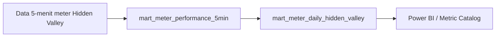

# Kamus Data: `mart.mart_meter_daily_hidden_valley`

**Grain:** 1 baris per `(date_key, asset_id)`  
**Model dbt:** `dbt/models/marts/mart_meter_daily_hidden_valley.sql`  
**Tujuan:** ringkasan energi harian meter khusus site Hidden Valley (jalur pilot HV).

---

## Penjelasan non-teknis

Tabel ini dipakai untuk menjawab pertanyaan sederhana:

- "Hari ini meter Hidden Valley menghasilkan/menyerap berapa energi?"
- "Per meter (PLN/Pump/Pool/Onsen/Meter Villa), total energinya berapa?"

Jadi tabel ini **fokus ke energi meter harian**, belum ke KPI/PR/availability level site.

---

## Alur data 5-menit ke daily (Hidden Valley)



Alur operasional:

1. Cron HV per jam melakukan ingest khusus Hidden Valley (`NE=60951882`, `NE=78317340`).
2. dbt menjalankan model intraday terkait HV.
3. Model ini mengubah data meter 5-menit menjadi energi harian per meter.

---

## Logika perhitungan inti

### 1) Pilih meter Hidden Valley yang relevan

Model hanya menghitung `asset_id` meter HV yang di-whitelist di SQL model.

### 2) Hitung energi harian per meter dari nilai kumulatif

Untuk tiap meter:

- Jika meter terdeteksi **kumulatif lintas hari**, energi hari ini = `max_hari_ini - max_hari_kemarin`.
- Jika meter **reset harian**, energi hari ini = `max_hari_ini - min_hari_ini`.

### 3) Simpan energi positif, negatif, dan net

- `daily_positive_active_energy_kwh` dari `metric_id = active_cap`
- `daily_negative_active_energy_kwh` dari `metric_id = reverse_active_cap`
- `daily_energy_kwh = ABS(negative - positive)` (net absolut)

---

## Definisi kolom

| Kolom | Nama tampilan | Definisi bisnis | Rumus / logika | Sumber | Koreksi |
|-------|----------------|------------------|----------------|--------|---------|
| `date_key` | Tanggal | Hari operasi | grain harian | `mart_meter_performance_5min` | - |
| `site_name` | Nama site | Selalu "Hidden Valley" | konstanta model | model SQL | - |
| `asset_id` | ID meter | ID perangkat meter | dari meter 5-menit | `mart_meter_performance_5min` | mapping device |
| `meter_name` | Nama meter | Nama meter untuk pembacaan user | join ke dimensi aset | `dim_assets` | `dim_assets` / seed aset |
| `meter_label` | Label meter | Label tampilan (sama dengan meter_name saat ini) | alias `meter_name` | model SQL | - |
| `daily_positive_active_energy_kwh` | Energi positif harian | Energi positif harian per meter | agregasi `active_cap` | meter 5-menit | ingest meter / mapping metric |
| `daily_negative_active_energy_kwh` | Energi negatif harian | Energi negatif harian per meter | agregasi `reverse_active_cap` | meter 5-menit | ingest meter / mapping metric |
| `daily_energy_kwh` | Energi net harian | Energi bersih meter per hari (absolut) | `ABS(negative - positive)` | turunan dua kolom di atas | cek logika bisnis meter |

---

## Perbedaan dengan `mart_site_performance_daily`

| Topik | `mart_site_performance_daily` (umum) | `mart_meter_daily_hidden_valley` (HV) |
|------|---------------------------------------|----------------------------------------|
| Grain | per site per hari | per meter per hari |
| Metrik | energi + GHI/POA + availability + PR + target + KPI | energi meter (+/-) |
| Pipeline | daily pipeline standar | jalur pilot HV (hourly + intraday) |
| Status | produksi utama | produksi khusus Hidden Valley |

---

## Cara verifikasi cepat (manual)

Contoh validasi satu meter satu hari:

1. Ambil nilai meter 5-menit awal/akhir hari dari `mart_meter_performance_5min`.
2. Hitung manual sesuai aturan kumulatif vs reset.
3. Bandingkan dengan nilai di `mart_meter_daily_hidden_valley`.

Query bantu:

```sql
select
  date_key,
  asset_id,
  meter_name,
  daily_positive_active_energy_kwh,
  daily_negative_active_energy_kwh,
  daily_energy_kwh
from mart.mart_meter_daily_hidden_valley
where site_name = 'Hidden Valley'
order by date_key desc, asset_id;
```

---

## Catatan status implementasi Hidden Valley

- `mart_site_performance_daily_hidden_valley` masih placeholder (`SELECT ... WHERE FALSE`), jadi metrik site-level HV belum dipublikasikan dari model tersebut.
- Untuk kebutuhan operasional saat ini, referensi daily utama HV adalah `mart_meter_daily_hidden_valley`.

---

*Versi dokumen: 2026-05-18.*
