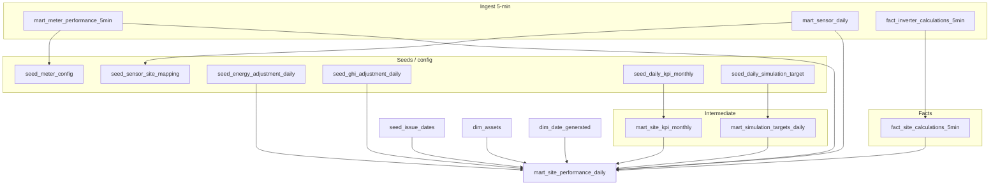

# Kamus Data: `mart.mart_site_performance_daily`

**Grain:** 1 baris per `(date_key, site_id)`  
**Model dbt:** `dbt/models/marts/mart_site_performance_daily.sql`  
**Query verifikasi:** `dbt/analyses/verify_site_performance_daily_one_day.sql`

---

## Diagram alur data (ringkas)



---

## Penjelasan singkat untuk user non-teknis

Tabel ini adalah **ringkasan performa harian per site**. Bahasa sederhananya:

1. Sistem mengumpulkan data setiap 5 menit (meter, sensor, inverter).
2. Data 5 menit diringkas jadi 1 angka per hari per site.
3. Angka harian itu dipakai untuk membaca performa operasional (energi, cuaca, availability, PR, target, KPI).

Jika dibandingkan dengan Hidden Valley:

- Pipeline biasa ini output-nya level **site** (`mart_site_performance_daily`).
- Hidden Valley saat ini output daily aktifnya level **meter** (`mart_meter_daily_hidden_valley`), karena model site-level HV masih placeholder.

Lihat kamus Hidden Valley: [mart_meter_daily_hidden_valley.md](./mart_meter_daily_hidden_valley.md).

---

## Bagian A — Identitas & dimensi

| Kolom | Nama tampilan | Definisi | Sumber | Koreksi |
|-------|---------------|----------|--------|---------|
| `date_key` | Tanggal | Hari operasional (timezone ingest → date_key) | Agregasi harian | — |
| `year`, `month`, `month_name`, `week_of_month` | Kalender | Atribut tanggal untuk laporan | `dim_date_generated` | — |
| `site_id` | Kode site | ID unifikasi site (`dim_assets.asset_id` level Site) | `dim_assets` | `dim_assets` / seed site |
| `site_name` | Nama site | Nama tampilan plant | `dim_assets` | — |
| `system` | Platform | `fusionsolar` / `isolarcloud` | `dim_assets` | — |
| `actual_capacity_kw` | Kapasitas (kW) | DC/AC capacity untuk PR | `dim_assets` | `seed_site_config` |
| `tariff` | Tarif | Tarif listrik (jika diisi) | `dim_assets` / `seed_site_config` | seed |
| `site_order` | Urutan tampilan | Sort order dashboard | `dim_assets` | seed |
| `is_issue_date` | Hari gangguan? | TRUE jika tanggal ada di `seed_issue_dates` | `seed_issue_dates` | Seed Manager |

---

## Bagian B — Energi (meter revenue)

| Kolom | Nama tampilan | Rumus / logika | Trail data | Cara cek | Koreksi |
|-------|---------------|----------------|------------|----------|---------|
| `daily_energy_mwh` | Energi harian (MWh) | Σ energi meter **Revenue** per site, kWh→MWh (÷1000). Meter kumulatif: Δ max antar hari; reset harian: max−min dalam hari. Polarity dari `seed_meter_config`. | `mart_meter_performance_5min` → JOIN `seed_meter_config` (`meter_type=Revenue`) → CTE `daily_energy` | Bandingkan dengan export meter portal; query revenue meter di `mart_meter_performance_5min` | `seed_meter_config`, reingest meter |
| `energy_actual` | Energi aktual | **Sama dengan** `daily_energy_mwh` (alias eksplisit) | = `daily_energy_mwh` | Harus identik | — |
| `energy_adjusted` | Energi disesuaikan | `COALESCE(seed_energy_adjustment_daily, daily_energy_mwh)` | Prioritas: (1) `seed_energy_adjustment_daily`, (2) aktual | Cek baris seed untuk site+tanggal | `seed_energy_adjustment_daily` |

**Catatan bisnis:** Jika `daily_energy_mwh = 0` padahal portal ada data → hampir selalu **meter belum di-seed** sebagai Revenue (bukan rumus salah).

---

## Bagian C — Irradiasi (GHI & POA)

| Kolom | Nama tampilan | Rumus / logika | Trail data | Cara cek | Koreksi |
|-------|---------------|----------------|------------|----------|---------|
| `daily_ghi_kwh_m2` | GHI harian | GHI site per hari setelah fallback/copy/override (`daily_ghi` CTE) | `mart_sensor_daily` + `seed_sensor_site_mapping` | Bandingkan sensor PYR/WST di portal | `seed_sensor_config`, `seed_sensor_site_mapping` |
| `ghi_actual` | GHI aktual | GHI operasional; bisa dari sensor lokal **atau** `GHI_ACTUAL_OVERRIDE` (mis. WST Shoetown) | Sama; branch override di model | Lihat override aktif di registry SQL §10 laporan | `seed_sensor_site_mapping` |
| `ghi_adjusted` | GHI disesuaikan | Prioritas: (1) `seed_ghi_adjustment_daily`, (2) mapping `GHI_ADJUSTED`, (3) `daily_ghi_kwh_m2` | Seeds + sensor mapping | | `seed_ghi_adjustment_daily`, mapping |
| `daily_poa_weighted_kwh_m2` | POA tertimbang | `Σ(POA_i × capacity_i) / Σ(capacity_i)` per hari; hanya sensor POA dengan capacity terisi | `mart_sensor_daily` (`sensor_type=POA`, `sensor_capacity_kwp` NOT NULL) | | `seed_sensor_config`, `seed_poa_sensor_config` |

---

## Bagian D — Availability & MIT

| Kolom | Nama tampilan | Rumus / logika | Trail data | Cara cek | Koreksi |
|-------|---------------|----------------|------------|----------|---------|
| `power_available_hours` | Jam inverter ON | Σ interval 5-menit dengan `power_available_ratio` × (5/60) | `fact_site_calculations_5min` | Drill-down 5-min | `seed_site_config.totalinverters`, inverter ingest |
| `unavailability_hours` | Jam tidak tersedia (saat MIT) | Σ `unavailability_ratio` × (5/60); hanya saat MIT=1 | `fact_site_calculations_5min` | | |
| `mit_hours` | Jam MIT | Jumlah interval dengan irradiance > ambang (40 W/m²) | Sensor → `fact_sensor_calculations_5min` → site fact | | Sensor / mapping |
| `total_hours` | Total jam interval | Count interval × 5/60 | fact site | | |
| `availability_percent` | Availability | `Σ power_available / (Σ power_available + Σ unavailability)` (desimal 0–1) | Aggregasi fact site | Bandingkan Excel availability | `total_inverters` di seed |

---

## Bagian E — Performance Ratio (PR)

**Semua PR disimpan sebagai desimal** (0.7345 = 73,45%). Dibatasi maksimum (GHI/adjusted cap 10.0; POA cap 2.0) untuk menangkap error data.

| Kolom | Nama tampilan | Rumus | Penyebut GHI/energi | Koreksi |
|-------|---------------|-------|---------------------|---------|
| `pr_ghi_actual` | PR GHI aktual | `(energy_mwh × 1000) / GHI_efektif / capacity_kw` | GHI: manual adj > mapping > `ghi_actual` | Capacity, energy, GHI |
| `pr_adjusted` | PR disesuaikan | `(energy_adj × 1000) / GHI_adj / capacity_kw` | Energy & GHI pakai jalur *adjusted* | Seeds adjustment |
| `pr_poa_actual` | PR POA | `(energy_mwh × 1000) / POA_weighted / capacity_kw` | POA tertimbang | POA seed |

Syarat NULL: GHI/POA < 0.1 kWh/m², energi < 0.01 MWh, atau capacity NULL/0.

---

## Bagian F — Target simulasi (harian)

Sumber join: `mart_simulation_targets_daily` ← `seed_daily_simulation_target`.

| Kolom | Nama tampilan | Definisi | Koreksi |
|-------|---------------|----------|---------|
| `energy_target_mwh` | Target energi harian | Target operasional **exclude** hari unavailability (kurva simulasi) | `seed_daily_simulation_target` |
| `ghi_target` | Target GHI harian | Dari seed simulasi | seed |
| `poa_target` | Target POA harian | Dari seed simulasi | seed |
| `daily_pr_ghi_target` | Target PR GHI harian | Dari seed | seed |
| `daily_pr_poa_target` | Target PR POA harian | Dari seed | seed |
| `energy_actual_vs_target_pct` | Energi vs target | `daily_energy_mwh / energy_target_mwh` (**desimal**, bukan %) | — |
| `ghi_actual_vs_target_pct` | GHI vs target | `daily_ghi / ghi_target` (desimal) | — |
| `poa_actual_vs_target_pct` | POA vs target | `daily_poa / poa_target` (desimal) | — |
| `energy_vs_ghi_variance_pct` | Selisih performa E vs GHI | `(E/E_target) − (GHI/GHI_target)` (desimal) | — |

---

## Bagian G — KPI & a_KPI (sering membingungkan)

### Konsep tiga angka bulanan

| Konsep | Kolom di mart | Sumber | Arti bisnis |
|--------|---------------|--------|-------------|
| **KPI bulanan** | `energy_kpi_monthly_mwh` | `seed_daily_kpi_monthly` → `mart_site_kpi_monthly` | Target kinerja operasional bulan ini (MWh) — angka yang disepakati manajemen |
| **Target bulanan** | `energy_target_monthly_mwh` | Σ `energy_target_mwh` harian di bulan itu | Kurva target harian (biasanya **tanpa** hari unavailability) |
| **Simulasi bulanan** | `energy_simulation_monthly_mwh` | Σ `energy_simulation_mwh` harian di bulan itu | Energi simulasi **termasuk** hari unavailability |

### Dua kolom harian turunan

| Kolom DB | Nama tampilan | Rumus | Kapan dipakai |
|----------|---------------|-------|---------------|
| `energy_kpi_daily_mwh` | **KPI harian (pro-rata)** | `KPI_bulan × (target_harian / target_bulan)` | Menyebarkan KPI bulanan mengikuti bentuk kurva **target** harian |
| `energy_a_kpi_daily_mwh` | **a_KPI / KPI adjusted harian** | `target_harian × (KPI_bulan / simulasi_bulan)` | Menyelaraskan **target harian** dengan KPI bulanan relatif terhadap simulasi penuh |

### Penjelasan a_KPI untuk user non-DE

**a_KPI** = "*adjusted KPI*" / target harian yang diskalakan KPI.

- **Bukan** availability.  
- **Bukan** energi aktual.  
- **Adalah** “berapa MWh KPI-implied untuk hari ini” jika bulan ini harus mencapai `energy_kpi_monthly_mwh`, dengan asumsi pola hari mengikuti **target** (bukan simulasi penuh).

**Contoh numerik:**

| Nilai | Angka contoh |
|-------|----------------|
| KPI bulan (MWh) | 300 |
| Simulasi bulan (MWh) | 320 (termasuk hari mati) |
| Target bulan (MWh) | 280 |
| Target hari ini (MWh) | 10 |
| **KPI harian** | `300 × (10/280) ≈ 10.71` MWh |
| **a_KPI harian** | `10 × (300/320) ≈ 9.38` MWh |

Interpretasi: simulasi lebih “gemuk” daripada target karena ada hari unavailability; a_KPI mengecilkan target harian agar konsisten dengan rasio KPI:simulasi.

### Trail data lengkap KPI

```
seed_daily_kpi_monthly (CSV, Seed Manager)
    → mart_site_kpi_monthly (energy_kpi_mwh per site, year, month)
    → JOIN mart_site_performance_daily

seed_daily_simulation_target
    → mart_simulation_targets_daily (target + simulation per hari)
    → agregasi bulanan di CTE mart_site_performance_daily
    → energy_kpi_daily_mwh, energy_a_kpi_daily_mwh
```

### Cara verifikasi a_KPI (wajib untuk konfirmasi user)

1. Jalankan `verify_site_performance_daily_one_day.sql` dengan site & tanggal.  
2. Bandingkan `energy_a_kpi_daily_mwh` di mart dengan `a_kpi_daily_recalc_mwh` di output query.  
3. Jika beda → cek join site_code vs site_name di `mart_simulation_targets_daily`.  
4. Jika angka KPI salah → edit **`seed_daily_kpi_monthly`**, bukan mart.

| Kolom | Koreksi jika salah |
|-------|-------------------|
| `energy_kpi_monthly_mwh` | `seed_daily_kpi_monthly` |
| `energy_target_monthly_mwh` / `energy_simulation_monthly_mwh` | `seed_daily_simulation_target` |
| `energy_kpi_daily_mwh` / `energy_a_kpi_daily_mwh` | Rumus di model (DE) atau seed di atas |

---

## Checklist konfirmasi user

Centang setelah diverifikasi terhadap Excel / portal (contoh: 3 tanggal per site per kuartal).

> **Cara pakai:** edit centang `[ ]` → `[x]` di file ini, atau cetak untuk rapat.  
> Tidak disimpan di Streamlit Metric Catalog dan tidak memerlukan tabel database.

| Kelompok | Reviewer | Tanggal | OK? |
|----------|----------|---------|-----|
| Energi (B) | | | [ ] |
| GHI/POA (C) | | | [ ] |
| Availability (D) | | | [ ] |
| PR (E) | | | [ ] |
| Target (F) | | | [ ] |
| **KPI & a_KPI (G)** | | | [ ] |

**Catatan reviewer KPI/a_KPI:**

```
Kami memahami:
- energy_kpi_daily_mwh = KPI bulan × (target harian / target bulan)
- energy_a_kpi_daily_mwh = target harian × (KPI bulan / simulasi bulan)
- Bukan energi aktual plant.

Nama: _______________  Tanggal: _______________
```

---

## Glosarium singkat

| Istilah | Arti di MMSR |
|-------|----------------|
| Revenue meter | Meter yang dipakai untuk energi jual/beli net — harus ada di `seed_meter_config` |
| MIT | Minimum Irradiance Threshold — jam dengan irradiance > ~40 W/m² |
| Override GHI | Aturan di `seed_sensor_site_mapping` mengganti sensor GHI default |
| a_KPI | Adjusted KPI daily — lihat Bagian G |
| Ratio vs % | Kolom `*_pct` di tabel ini = **rasio desimal**, bukan 0–100 |

---

*Versi dokumen: 2026-05-18. Sinkronkan dengan model dbt jika ada perubahan rumus.*
