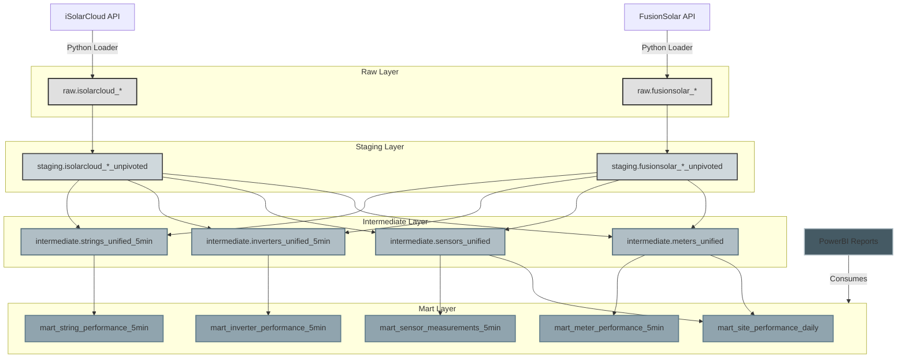

# Solar Energy Monitoring - PowerBI Integration Database

*Last Updated: October 27, 2025*

## Version Control

- **Version**: 2.1
- **Author**: [Your Name]
- **Reviewers**: [Team Members]
- **Status**: Draft
- **Alignment**: PowerBI Architecture v1.0

## 1. Database Architecture Overview

### 1.1 Schema Structure

```sql
-- Core Data Flow Schemas
CREATE SCHEMA raw;              -- Raw API data from FusionSolar/iSolarCloud
CREATE SCHEMA staging;          -- Cleaned and unpivoted data
CREATE SCHEMA intermediate;     -- Unified models across data sources
CREATE SCHEMA marts;            -- Final fact tables for reporting

-- Support Schemas
CREATE SCHEMA seeds;            -- Configuration and mapping data
CREATE SCHEMA dq;               -- Data quality monitoring
CREATE SCHEMA monitoring;       -- System performance monitoring
CREATE SCHEMA utils;            -- Utility functions and helpers
```

### 1.2 Data Flow




## 2. Current Database State

### 2.1 Existing Database Structure

The current production database contains the following key components:

#### 2.1.1 Schemas

- **public**: Contains all tables and views
- **Other schemas**: Currently not in use (all objects are in public schema)

#### 2.1.2 Core Tables

##### iSolarCloud Tables

1. **isolarcloud_power_stations**
  - Stores power plant metadata
  - Key fields: `ps_id` (PK), `ps_name`, `latitude`, `longitude`, `total_capacity`
  - Tracks installation and grid connection details
2. **isolarcloud_devices**
  - Contains device information for each power station
  - Key fields: `device_ps_key` (PK), `ps_id` (FK), `device_type`, `device_name`
  - Tracks device specifications and status
3. **isolarcloud_historical_data**
  - Time-series data for devices
  - Key fields: `device_ps_key` (PK), `timestamp` (PK), `measurement_data` (JSONB)
  - Indexed on `timestamp` for efficient time-based queries

##### FusionSolar Tables

1. **fusionsolar_plants**
  - Plant metadata and specifications
  - Key fields: `plant_code` (PK), `plant_name`, `capacity`, `grid_connection_date`
2. **fusionsolar_devices**
  - Device information including inverters
  - Key fields: `dev_id` (PK), `plant_code` (FK), `dev_type_id`, `dev_name`
3. **fusionsolar_historical_data**
  - Time-series measurements
  - Key fields: `dev_id` (PK), `collect_time` (PK), `measurement_data` (JSONB)
  - Indexed on `collect_time`

### 2.2 Views Structure

The database contains a comprehensive set of views for each power plant, following a consistent naming pattern:

1. **Inverter Data Views**
  - `*_inverter_data`: Raw measurements (voltage, current per string)
  - `*_inverter_pivoted`: Pivoted view by device
  - `*_inverter_pivoted_daily_energy`: Daily string-level energy aggregation by inverter device
  - `*_inverter_summary_data`: inverter summary statistics
2. **Meteorological Station Views**
  - `*_meteo_station_data`: Raw weather data
  - `*_meteo_station_pivoted`: Formatted weather metrics
3. **Meter Data Views**
  - `*_meter_data`: Raw meter readings
  - `*_meter_pivoted`: Formatted meter data

### 2.3 Data Characteristics

- **Update Frequency**: 5-minute intervals
- **Data Retention**:
  - Raw data: 30 days
  - Aggregated data: 1 year+
- **Data Volume**:
  - Multiple GB of time-series data
  - High-frequency measurements (5-min intervals)
  - Multiple parameters per device

## 3. Migration Plan to Target Architecture

### 3.1 Phase 1: Schema Restructuring

1. **Create New Schemas**
  ```sql
   -- Core Data Flow Schemas
   CREATE SCHEMA raw;              -- Raw API data from FusionSolar/iSolarCloud
   CREATE SCHEMA staging;          -- Cleaned and unpivoted data
   CREATE SCHEMA intermediate;     -- Unified models across data sources
   CREATE SCHEMA marts;            -- Final fact tables for reporting

   -- Support Schemas
   CREATE SCHEMA seeds;            -- Configuration and mapping data
   CREATE SCHEMA dq;               -- Data quality monitoring
   CREATE SCHEMA monitoring;       -- System performance monitoring
   CREATE SCHEMA utils;            -- Utility functions and helpers
  ```
2. **Data Migration**
  - Create ETL jobs to migrate existing data to new schema structure
  - Implement incremental loading for ongoing updates
  - Set up data validation checks

### 3.2 Phase 2: Data Model Enhancement

1. **Implement Dimension Tables**
  - `dim_date` - Date dimension for time-based analysis
  - `dim_plant` - Unified plant information
  - `dim_device` - Standardized device information
  - `dim_metric` - Metric definitions and units
2. **Create MVP Fact Tables**
  ### 2.1 Inverter Performance (5-minute intervals)
  ### 2.2 Meteorological Data (5-minute intervals)
  ### 2.3 Meter Data (5-minute intervals)
  ### 2.4 Data Source Mapping Table

### 3.3 Phase 3: Implementation Timeline


| Phase | Tasks                | Duration | Dependencies |
| ----- | -------------------- | -------- | ------------ |
| 1.1   | Schema Creation      | 1 week   | None         |
| 1.2   | Data Migration       | 2 weeks  | 1.1          |
| 2.1   | Dimension Tables     | 1 week   | 1.1          |
| 2.2   | Fact Tables          | 2 weeks  | 2.1          |
| 3.1   | Testing & Validation | 1 week   | 2.2          |
| 3.2   | Deployment           | 1 week   | 3.1          |


## 4. Current State Analysis

### 4.1 Existing Structure

#### FusionSolar

- **Data Types**:
  - Plant metadata (sites, inverters, strings)
  - 5-minute performance metrics
  - Daily aggregated data
  - Alarms and events
- **Update Frequency**: 5-minute intervals daily updates    
- **Retention**: 30 days raw data, 1 year aggregated

#### iSolarCloud

- **Data Types**:
  - Site and device metadata
  - Real-time sensor data
  - Performance metrics
  - Weather data
- **Update Frequency**: 5-15 minute intervals daily updates
- **Retention**: 30 days raw data, 1 year aggregated

### 2.2 Configuration Management

#### Seed Tables

```sql
-- Metric mapping between source systems and unified model
CREATE TABLE seeds.metric_mapper (
    id SERIAL PRIMARY KEY,
    source_system VARCHAR(20) NOT NULL,  -- 'FusionSolar' or 'iSolarCloud'
    source_metric_name VARCHAR(100) NOT NULL,
    target_metric_name VARCHAR(100) NOT NULL,
    metric_type VARCHAR(50) NOT NULL,    -- 'inverter', 'string', 'meter', 'sensor'
    unit VARCHAR(20),
    description TEXT,
    is_active BOOLEAN DEFAULT TRUE,
    created_at TIMESTAMPTZ DEFAULT NOW(),
    updated_at TIMESTAMPTZ DEFAULT NOW(),
    UNIQUE(source_system, source_metric_name)
);

-- String configuration and specifications
CREATE TABLE seeds.string_config (
    id SERIAL PRIMARY KEY,
    plant_id VARCHAR(50) NOT NULL,
    inverter_id VARCHAR(50) NOT NULL,
    string_id VARCHAR(50) NOT NULL,
    panel_count INTEGER,
    panel_capacity_w DECIMAL(10,2),
    azimuth_degrees INTEGER,
    tilt_degrees INTEGER,
    installation_date DATE,
    is_active BOOLEAN DEFAULT TRUE,
    created_at TIMESTAMPTZ DEFAULT NOW(),
    updated_at TIMESTAMPTZ DEFAULT NOW(),
    UNIQUE(plant_id, inverter_id, string_id)
);

-- Sensor configuration
CREATE TABLE seeds.sensor_config (
    id SERIAL PRIMARY KEY,
    sensor_id VARCHAR(100) NOT NULL,
    sensor_type VARCHAR(50) NOT NULL,
    location_description TEXT,
    manufacturer VARCHAR(100),
    model VARCHAR(100),
    installation_date DATE,
    calibration_date DATE,
    is_active BOOLEAN DEFAULT TRUE,
    created_at TIMESTAMPTZ DEFAULT NOW(),
    updated_at TIMESTAMPTZ DEFAULT NOW(),
    UNIQUE(sensor_id)
);

-- Simulation targets for performance comparison
CREATE TABLE seeds.simulation_targets (
    id SERIAL PRIMARY KEY,
    asset_type VARCHAR(50) NOT NULL,  -- 'plant', 'inverter', 'string'
    asset_id VARCHAR(100) NOT NULL,
    target_date DATE NOT NULL,
    target_value DECIMAL(12,4) NOT NULL,
    target_unit VARCHAR(20) NOT NULL,
    target_type VARCHAR(50) NOT NULL,  -- 'energy_kwh', 'power_kw', 'irradiance', etc.
    source VARCHAR(100) NOT NULL,      -- Source of the target (e.g., 'pvwatts', 'manual')
    notes TEXT,
    created_at TIMESTAMPTZ DEFAULT NOW(),
    updated_at TIMESTAMPTZ DEFAULT NOW(),
    UNIQUE(asset_type, asset_id, target_date, target_type)
);

-- Cleaning log for sensors and modules (per site)
CREATE TABLE seeds.cleaning_log (
    id SERIAL PRIMARY KEY,
    asset_type VARCHAR(50) NOT NULL,  -- 'Sensor' or 'Module'
    site_id VARCHAR(100) NOT NULL,     -- site_id (cleaning dilakukan per site)
    cleaning_date DATE NOT NULL,       -- Tanggal pembersihan
    notes TEXT,                        -- Catatan tambahan (opsional)
    is_active BOOLEAN DEFAULT TRUE,    -- Flag untuk data aktif
    created_at TIMESTAMPTZ DEFAULT NOW(),
    updated_at TIMESTAMPTZ DEFAULT NOW(),
    UNIQUE(asset_type, site_id, cleaning_date)
);

## 3. Core Data Model

### 3.1 Dimension Tables

#### Date Dimension
```sql
CREATE TABLE dim_date (
    date_key DATE PRIMARY KEY,
    day_of_week SMALLINT NOT NULL CHECK (day_of_week BETWEEN 1 AND 7),
    day_name VARCHAR(9) NOT NULL,
    day_of_month SMALLINT NOT NULL CHECK (day_of_month BETWEEN 1 AND 31),
    day_of_year SMALLINT NOT NULL CHECK (day_of_year BETWEEN 1 AND 366),
    week_of_year SMALLINT NOT NULL CHECK (week_of_year BETWEEN 1 AND 53),
    month SMALLINT NOT NULL CHECK (month BETWEEN 1 AND 12),
    month_name VARCHAR(9) NOT NULL,
    quarter SMALLINT NOT NULL CHECK (quarter BETWEEN 1 AND 4),
    year SMALLINT NOT NULL,
    is_weekend BOOLEAN NOT NULL,
    is_holiday BOOLEAN NOT NULL,
    is_business_day BOOLEAN NOT NULL,
    season VARCHAR(10) CHECK (season IN ('Spring', 'Summer', 'Autumn', 'Winter')),
    fiscal_year INTEGER,
    fiscal_quarter SMALLINT CHECK (fiscal_quarter BETWEEN 1 AND 4)
);
```

#### Asset Dimension (SCD Type 2)

```sql
CREATE TABLE dim_assets (
    asset_key SERIAL PRIMARY KEY,
    asset_id VARCHAR(100) NOT NULL,
    asset_type VARCHAR(50) NOT NULL,  -- 'plant', 'inverter', 'string', 'meter', 'sensor'
    parent_asset_key INTEGER,  -- Self-referential for hierarchy
    asset_name VARCHAR(200) NOT NULL,
    source_system VARCHAR(20) NOT NULL,  -- 'FusionSolar' or 'iSolarCloud'
    source_id VARCHAR(100) NOT NULL,     -- Original ID from source system
    
    -- Location Information
    location_geo GEOGRAPHY(POINT, 4326),
    address TEXT,
    city VARCHAR(100),
    state_province VARCHAR(100),
    country VARCHAR(100),
    postal_code VARCHAR(20),
    timezone VARCHAR(50),
    
    -- Technical Specifications
    capacity_kw DECIMAL(10,2),
    manufacturer VARCHAR(100),
    model VARCHAR(100),
    serial_number VARCHAR(100),
    
    -- Status and Lifecycle
    installation_date DATE,
    commissioning_date DATE,
    decommissioning_date DATE,
    status VARCHAR(50) NOT NULL,
    is_active BOOLEAN NOT NULL,
    
    -- SCD2 Fields
    valid_from TIMESTAMPTZ NOT NULL,
    valid_to TIMESTAMPTZ,
    current_flag BOOLEAN NOT NULL,
    
    -- Metadata
    custom_attributes JSONB,
    etl_batch_id VARCHAR(100),
    created_at TIMESTAMPTZ NOT NULL DEFAULT NOW(),
    updated_at TIMESTAMPTZ NOT NULL DEFAULT NOW(),
    
    -- Constraints
    CONSTRAINT fk_parent_asset FOREIGN KEY (parent_asset_key) 
        REFERENCES dim_assets(asset_key) ON DELETE SET NULL,
    CONSTRAINT chk_asset_dates CHECK (
        installation_date <= COALESCE(commissioning_date, '9999-12-31'::date) AND
        COALESCE(decommissioning_date, '9999-12-31'::date) >= COALESCE(commissioning_date, '1900-01-01'::date)
    ),
    CONSTRAINT chk_scd_dates CHECK (valid_from < COALESCE(valid_to, 'infinity'::timestamp))
);

-- Indexes
CREATE INDEX idx_assets_asset_id ON dim_assets(asset_id);
CREATE INDEX idx_assets_source ON dim_assets(source_system, source_id);
CREATE INDEX idx_assets_current ON dim_assets(current_flag) WHERE current_flag = true;
CREATE INDEX idx_assets_type ON dim_assets(asset_type);
CREATE INDEX idx_assets_location ON dim_assets USING GIST (location_geo);

-- Update trigger for SCD2
CREATE OR REPLACE FUNCTION update_asset_modified()
RETURNS TRIGGER AS $$
BEGIN
    NEW.updated_at = NOW();
    RETURN NEW;
END;
$$ LANGUAGE plpgsql;

CREATE TRIGGER trg_asset_modified
BEFORE UPDATE ON dim_assets
FOR EACH ROW EXECUTE FUNCTION update_asset_modified();
```

### 3.2 Fact Tables

#### Inverter Performance (5-minute)

```sql
CREATE TABLE fact_inverter_performance_5min (
    inverter_key INTEGER NOT NULL,
    timestamp TIMESTAMPTZ NOT NULL,
    date_key DATE NOT NULL,
    
    -- Power Metrics
    dc_power_w NUMERIC(10,2),
    ac_power_w NUMERIC(10,2),
    power_factor NUMERIC(5,4),
    
    -- Voltage/Current
    dc_voltage_v NUMERIC(10,2),
    dc_current_a NUMERIC(10,2),
    ac_voltage_v NUMERIC(10,2),
    ac_current_a NUMERIC(10,2),
    
    -- Energy
    daily_energy_wh NUMERIC(12,2),
    lifetime_energy_kwh NUMERIC(15,2),
    
    -- Temperature
    temperature_c NUMERIC(5,2),
    
    -- Status
    status_code INTEGER,
    status_message VARCHAR(255),
    
    -- Metadata
    data_source VARCHAR(20) NOT NULL,
    etl_batch_id VARCHAR(100),
    created_at TIMESTAMPTZ NOT NULL DEFAULT NOW(),
    
    -- Constraints
    CONSTRAINT pk_inverter_perf_5min PRIMARY KEY (inverter_key, timestamp),
    CONSTRAINT fk_inv_perf_asset FOREIGN KEY (inverter_key) 
        REFERENCES dim_assets(asset_key),
    CONSTRAINT fk_inv_perf_date FOREIGN KEY (date_key) 
        REFERENCES dim_date(date_key)
) PARTITION BY RANGE (timestamp);

-- Create monthly partitions
CREATE TABLE fact_inverter_perf_5min_y2023m10 PARTITION OF fact_inverter_performance_5min
    FOR VALUES FROM ('2023-10-01 00:00:00+00') TO ('2023-11-01 00:00:00+00');

-- Create index on the partition key
CREATE INDEX idx_inv_perf_5min_ts ON fact_inverter_performance_5min(timestamp);
CREATE INDEX idx_inv_perf_5min_date ON fact_inverter_performance_5min(date_key);
```

#### String Performance (5-minute)

```sql
CREATE TABLE fact_string_performance_5min (
    string_key INTEGER NOT NULL,
    timestamp TIMESTAMPTZ NOT NULL,
    date_key DATE NOT NULL,
    
    -- Electrical Metrics
    voltage_v NUMERIC(10,2),
    current_a NUMERIC(10,2),
    power_w NUMERIC(10,2),
    
    -- Irradiance (if available)
    irradiance_wm2 NUMERIC(8,2),
    module_temp_c NUMERIC(5,2),
    
    -- Status
    status_code INTEGER,
    alarm_flag BOOLEAN,
    
    -- Metadata
    data_source VARCHAR(20) NOT NULL,
    etl_batch_id VARCHAR(100),
    created_at TIMESTAMPTZ NOT NULL DEFAULT NOW(),
    
    -- Constraints
    CONSTRAINT pk_string_perf_5min PRIMARY KEY (string_key, timestamp),
    CONSTRAINT fk_string_perf_asset FOREIGN KEY (string_key) 
        REFERENCES dim_assets(asset_key),
    CONSTRAINT fk_string_perf_date FOREIGN KEY (date_key) 
        REFERENCES dim_date(date_key)
) PARTITION BY RANGE (timestamp);

-- Create monthly partitions
CREATE TABLE fact_string_perf_5min_y2023m10 PARTITION OF fact_string_performance_5min
    FOR VALUES FROM ('2023-10-01 00:00:00+00') TO ('2023-11-01 00:00:00+00');

-- Create index on the partition key
CREATE INDEX idx_string_perf_5min_ts ON fact_string_performance_5min(timestamp);
CREATE INDEX idx_string_perf_5min_date ON fact_string_performance_5min(date_key);
```

#### Site Performance (Daily)

```sql
CREATE TABLE fact_site_performance_daily (
    site_key INTEGER NOT NULL,
    date_key DATE NOT NULL,
    
    -- Energy Production
    production_kwh NUMERIC(12,4),
    consumption_kwh NUMERIC(12,4),
    export_kwh NUMERIC(12,4),
    import_kwh NUMERIC(12,4),
    
    -- Performance Metrics
    performance_ratio NUMERIC(5,4),
    specific_yield_kwh_kwp NUMERIC(10,4),
    capacity_factor NUMERIC(5,4),
    
    -- Weather Data
    avg_ambient_temp_c NUMERIC(5,2),
    max_ambient_temp_c NUMERIC(5,2),
    min_ambient_temp_c NUMERIC(5,2),
    total_irradiance_wh_m2 NUMERIC(10,2),
    peak_irradiance_w_m2 NUMERIC(8,2),
    
    -- System Availability
    uptime_seconds INTEGER,
    downtime_seconds INTEGER,
    availability_pct NUMERIC(5,2),
    
    -- Metadata
    data_source VARCHAR(20) NOT NULL,
    etl_batch_id VARCHAR(100),
    created_at TIMESTAMPTZ NOT NULL DEFAULT NOW(),
    updated_at TIMESTAMPTZ NOT NULL DEFAULT NOW(),
    
    -- Constraints
    CONSTRAINT pk_site_perf_daily PRIMARY KEY (site_key, date_key),
    CONSTRAINT fk_site_perf_asset FOREIGN KEY (site_key) 
        REFERENCES dim_assets(asset_key),
    CONSTRAINT fk_site_perf_date FOREIGN KEY (date_key) 
        REFERENCES dim_date(date_key),
    CONSTRAINT chk_energy_positive CHECK (
        COALESCE(production_kwh, 0) >= 0 AND
        COALESCE(consumption_kwh, 0) >= 0 AND
        COALESCE(export_kwh, 0) >= 0 AND
        COALESCE(import_kwh, 0) >= 0
    )
);

-- Create index on date for time-based queries
CREATE INDEX idx_site_perf_daily_date ON fact_site_performance_daily(date_key);
CREATE INDEX idx_site_perf_daily_site ON fact_site_performance_daily(site_key);
```

### 3.3 Materialized Views for Reporting

#### Daily Aggregations

```sql
CREATE MATERIALIZED VIEW mv_daily_plant_performance AS
SELECT 
    p.plant_key,
    p.plant_name,
    d.date_key,
    d.day_name,
    d.month_name,
    d.year,
    SUM(f.production_kwh) AS total_production_kwh,
    SUM(f.consumption_kwh) AS total_consumption_kwh,
    SUM(f.export_kwh) AS total_export_kwh,
    SUM(f.import_kwh) AS total_import_kwh,
    AVG(f.performance_ratio) AS avg_performance_ratio,
    AVG(f.capacity_factor) AS avg_capacity_factor,
    MAX(p.capacity_kw) AS installed_capacity_kw
FROM fact_site_performance_daily f
JOIN dim_assets p ON f.plant_key = p.asset_key
JOIN dim_date d ON f.date_key = d.date_key
GROUP BY p.plant_key, p.plant_name, d.date_key, d.day_name, d.month_name, d.year
WITH DATA;

-- Create index on the materialized view
CREATE UNIQUE INDEX idx_mv_daily_plant_perf ON mv_daily_plant_performance(plant_key, date_key);
```

#### Inverter Performance Summary

```sql
CREATE MATERIALIZED VIEW mv_inverter_performance_daily AS
SELECT 
    i.inverter_key,
    i.inverter_name,
    p.plant_key,
    p.plant_name,
    d.date_key,
    d.day_name,
    d.month_name,
    d.year,
    COUNT(*) AS data_points,
    AVG(f.dc_power_w) AS avg_dc_power_w,
    MAX(f.dc_power_w) AS max_dc_power_w,
    SUM(f.daily_energy_wh) / 1000.0 AS daily_energy_kwh,
    AVG(f.efficiency) AS avg_efficiency,
    AVG(f.temperature_c) AS avg_temperature_c
FROM fact_inverter_performance_5min f
JOIN dim_assets i ON f.inverter_key = i.asset_key
JOIN dim_assets p ON i.parent_asset_key = p.asset_key
JOIN dim_date d ON f.date_key = d.date_key
GROUP BY 
    i.inverter_key, i.inverter_name, 
    p.plant_key, p.plant_name,
    d.date_key, d.day_name, d.month_name, d.year
WITH DATA;

-- Create index on the materialized view
CREATE UNIQUE INDEX idx_mv_inverter_perf_daily ON mv_inverter_performance_daily(inverter_key, date_key);
```

#### 2.1.4 Data Marts (Business Views)

- **Purpose**: Optimized for reporting and analytics
- **Features**:
  - Pre-aggregated metrics
  - Business-friendly column names
  - Performance-optimized
- **Views**:
  - `marts.daily_plant_summary`
  - `marts.inverter_performance`
  - `marts.alert_analytics`

### 2.2 Core Tables Structure

#### 2.2.1 Dimension Tables

```sql
-- Date Dimension
CREATE TABLE dim_date (
    date_id DATE PRIMARY KEY,
    day_of_week SMALLINT,
    day_name VARCHAR(9),
    month SMALLINT,
    month_name VARCHAR(9),
    quarter SMALLINT,
    year SMALLINT,
    is_weekend BOOLEAN,
    is_holiday BOOLEAN
);

-- Plant Dimension
CREATE TABLE dim_plant (
    plant_id SERIAL PRIMARY KEY,
    plant_code VARCHAR(50) UNIQUE,
    plant_name VARCHAR(100),
    location GEOGRAPHY(POINT, 4326),
    capacity_kw DECIMAL(10,2),
    installation_date DATE,
    status VARCHAR(20),
    data_source VARCHAR(20)  -- 'FusionSolar' or 'iSolarCloud'
);

-- Inverter Dimension
CREATE TABLE dim_inverter (
    inverter_id SERIAL PRIMARY KEY,
    inverter_code VARCHAR(50) UNIQUE,
    plant_id INTEGER REFERENCES dim_plant(plant_id),
    model VARCHAR(100),
    capacity_kw DECIMAL(10,2),
    installation_date DATE,
    status VARCHAR(20)
);
```

#### 2.2.2 Fact Tables

```sql
-- Energy Production Fact
CREATE TABLE fact_energy_production (
    production_id BIGSERIAL PRIMARY KEY,
    date_id DATE REFERENCES dim_date(date_id),
    plant_id INTEGER REFERENCES dim_plant(plant_id),
    inverter_id INTEGER REFERENCES dim_inverter(inverter_id),
    energy_kwh DECIMAL(12,4),
    peak_power_kw DECIMAL(10,4),
    production_hours DECIMAL(5,2),
    performance_ratio DECIMAL(5,2),
    created_at TIMESTAMPTZ DEFAULT NOW(),
    updated_at TIMESTAMPTZ DEFAULT NOW(),
    UNIQUE(date_id, plant_id, inverter_id)
);

-- Inverter Metrics (Time Series)
CREATE TABLE fact_inverter_metrics (
    metric_id BIGSERIAL PRIMARY KEY,
    timestamp TIMESTAMPTZ,
    inverter_id INTEGER REFERENCES dim_inverter(inverter_id),
    dc_voltage DECUIMAL(10,2),
    dc_current DECIMAL(10,2),
    ac_voltage DECIMAL(10,2),
    ac_current DECIMAL(10,2),
    frequency_hz DECIMAL(6,2),
    temperature_c DECIMAL(5,2),
    created_at TIMESTAMPTZ DEFAULT NOW()
);

-- Create hypertable for time-series data
SELECT create_hypertable('fact_inverter_metrics', 'timestamp');
```

### 2.3 View Implementation Strategy

#### 2.3.1 Materialized Views

```sql
-- Daily Plant Summary
CREATE MATERIALIZED VIEW marts.daily_plant_summary AS
SELECT 
    p.plant_name,
    d.date_id,
    SUM(ep.energy_kwh) AS total_energy_kwh,
    AVG(ep.performance_ratio) AS avg_performance_ratio,
    MAX(ep.peak_power_kw) AS peak_power_kw
FROM fact_energy_production ep
JOIN dim_plant p ON ep.plant_id = p.plant_id
JOIN dim_date d ON ep.date_id = d.date_id
GROUP BY p.plant_name, d.date_id
WITH DATA;

-- Inverter Performance View
CREATE VIEW marts.inverter_performance AS
SELECT 
    i.inverter_code,
    p.plant_name,
    d.date_id,
    d.month_name,
    d.year,
    ep.energy_kwh,
    ep.performance_ratio,
    im.avg_daily_temp
FROM fact_energy_production ep
JOIN dim_inverter i ON ep.inverter_id = i.inverter_id
JOIN dim_plant p ON i.plant_id = p.plant_id
JOIN dim_date d ON ep.date_id = d.date_id
LEFT JOIN (
    SELECT 
        inverter_id,
        date_trunc('day', timestamp) as metric_date,
        AVG(temperature_c) as avg_daily_temp
    FROM fact_inverter_metrics
    GROUP BY 1, 2
) im ON ep.inverter_id = im.inverter_id AND ep.date_id = im.metric_date::date;

-- Alert View
CREATE VIEW marts.alert_analytics AS
SELECT 
    a.alert_id,
    p.plant_name,
    i.inverter_code,
    a.alert_type,
    a.severity,
    a.start_time,
    a.end_time,
    a.status,
    a.description
FROM fact_alerts a
LEFT JOIN dim_inverter i ON a.inverter_id = i.inverter_id
LEFT JOIN dim_plant p ON i.plant_id = p.plant_id;
```

#### 2.3.2 View Refresh Strategy

```sql
-- Refresh materialized views concurrently to avoid locking
REFRESH MATERIALIZED VIEW CONCURRENTLY marts.daily_plant_summary;

-- Create refresh function for automation
CREATE OR REPLACE FUNCTION refresh_views()
RETURNS VOID AS $$
BEGIN
    REFRESH MATERIALIZED VIEW CONCURRENTLY marts.daily_plant_summary;
    -- Add other views as needed
END;
$$ LANGUAGE plpgsql;
```

## 4. Data Quality & Monitoring

### 4.1 Data Quality Framework

#### Data Quality Rules

```sql
-- Data quality rules definition
CREATE TABLE dq.rules (
    rule_id SERIAL PRIMARY KEY,
    rule_name VARCHAR(100) NOT NULL UNIQUE,
    rule_description TEXT,
    rule_type VARCHAR(50) NOT NULL CHECK (rule_type IN (
        'completeness', 'consistency', 'validity', 
        'accuracy', 'uniqueness', 'timeliness'
    )),
    severity VARCHAR(20) NOT NULL CHECK (severity IN ('critical', 'warning', 'info')),
    is_active BOOLEAN NOT NULL DEFAULT TRUE,
    error_message_template TEXT NOT NULL,
    check_condition TEXT NOT NULL,
    remediation_guidance TEXT,
    created_by VARCHAR(100) NOT NULL,
    created_at TIMESTAMPTZ NOT NULL DEFAULT NOW(),
    updated_by VARCHAR(100),
    updated_at TIMESTAMPTZ,
    last_executed_at TIMESTAMPTZ,
    execution_frequency INTERVAL
);

-- Example rule: Check for negative energy values
INSERT INTO dq.rules (
    rule_name,
    rule_description,
    rule_type,
    severity,
    is_active,
    error_message_template,
    check_condition,
    remediation_guidance,
    created_by
) VALUES (
    'energy_non_negative',
    'Energy values should never be negative',
    'validity',
    'critical',
    true,
    'Found {count} records with negative energy values in {table}',
    'SELECT COUNT(*) FROM {schema}.{table} WHERE energy_kwh < 0',
    'Investigate the data source for incorrect measurements or ETL issues',
    'system'
);
```

### 4.2 Automated Monitoring

#### Performance Monitoring

```sql
-- Query performance monitoring
CREATE TABLE monitoring.query_performance (
    query_id BIGSERIAL PRIMARY KEY,
    query_text TEXT NOT NULL,
    execution_time_ms BIGINT NOT NULL,
    execution_timestamp TIMESTAMPTZ NOT NULL DEFAULT NOW(),
    rows_returned INTEGER,
    rows_affected INTEGER,
    database_name VARCHAR(100),
    username VARCHAR(100),
    application_name VARCHAR(100),
    client_addr INET,
    error_message TEXT,
    execution_plan JSONB,
    parameters JSONB
);

-- Create index for time-based analysis
CREATE INDEX idx_query_perf_ts ON monitoring.query_performance(execution_timestamp);
CREATE INDEX idx_query_perf_duration ON monitoring.query_performance(execution_time_ms);

-- Slow query log function
CREATE OR REPLACE FUNCTION monitoring.log_slow_query(
    p_query_text TEXT,
    p_execution_time_ms BIGINT,
    p_rows_returned INTEGER DEFAULT NULL,
    p_rows_affected INTEGER DEFAULT NULL,
    p_error_message TEXT DEFAULT NULL,
    p_parameters JSONB DEFAULT NULL,
    p_execution_plan JSONB DEFAULT NULL
)
RETURNS BIGINT AS $$
DECLARE
    v_query_id BIGINT;
BEGIN
    INSERT INTO monitoring.query_performance (
        query_text,
        execution_time_ms,
        rows_returned,
        rows_affected,
        error_message,
        database_name,
        username,
        application_name,
        client_addr,
        execution_plan,
        parameters
    ) VALUES (
        p_query_text,
        p_execution_time_ms,
        p_rows_returned,
        p_rows_affected,
        p_error_message,
        current_database(),
        current_user,
        current_setting('application_name', true),
        inet_client_addr(),
        p_execution_plan,
        p_parameters
    )
    RETURNING query_id INTO v_query_id;
    
    RETURN v_query_id;
END;
$$ LANGUAGE plpgsql SECURITY DEFINER;
```

### 4.3 Alerting System

#### Alert Definitions

```sql
-- Alert definitions
CREATE TABLE monitoring.alert_definitions (
    alert_definition_id SERIAL PRIMARY KEY,
    alert_name VARCHAR(100) NOT NULL,
    alert_description TEXT,
    severity VARCHAR(20) NOT NULL CHECK (severity IN ('critical', 'warning', 'info')),
    check_interval INTERVAL NOT NULL DEFAULT '1 hour',
    check_query TEXT NOT NULL,
    condition_operator VARCHAR(10) NOT NULL CHECK (condition_operator IN ('>', '>=', '=', '<=', '<', '!=')),
    condition_threshold NUMERIC,
    condition_value TEXT,
    is_active BOOLEAN NOT NULL DEFAULT TRUE,
    notification_channels TEXT[],
    created_at TIMESTAMPTZ NOT NULL DEFAULT NOW(),
    updated_at TIMESTAMPTZ,
    last_checked_at TIMESTAMPTZ,
    last_triggered_at TIMESTAMPTZ
);

-- Alert history
CREATE TABLE monitoring.alert_history (
    alert_history_id BIGSERIAL PRIMARY KEY,
    alert_definition_id INTEGER REFERENCES monitoring.alert_definitions(alert_definition_id),
    triggered_at TIMESTAMPTZ NOT NULL DEFAULT NOW(),
    resolved_at TIMESTAMPTZ,
    status VARCHAR(20) NOT NULL CHECK (status IN ('triggered', 'resolved', 'acknowledged')),
    severity VARCHAR(20) NOT NULL,
    alert_details JSONB,
    acknowledged_by VARCHAR(100),
    acknowledged_at TIMESTAMPTZ,
    resolution_notes TEXT
);

-- Function to check and trigger alerts
CREATE OR REPLACE FUNCTION monitoring.check_alerts()
RETURNS INTEGER AS $$
DECLARE
    r RECORD;
    v_result NUMERIC;
    v_condition_met BOOLEAN;
    v_alert_id BIGINT;
    v_count INTEGER := 0;
BEGIN
    FOR r IN 
        SELECT * 
        FROM monitoring.alert_definitions 
        WHERE is_active = TRUE 
        AND (last_checked_at IS NULL OR last_checked_at + check_interval < NOW())
    LOOP
        BEGIN
            -- Execute the check query
            EXECUTE r.check_query INTO v_result;
            
            -- Check the condition
            CASE r.condition_operator
                WHEN '>' THEN v_condition_met := (v_result > r.condition_threshold);
                WHEN '>=' THEN v_condition_met := (v_result >= r.condition_threshold);
                WHEN '=' THEN v_condition_met := (v_result = r.condition_threshold);
                WHEN '<=' THEN v_condition_met := (v_result <= r.condition_threshold);
                WHEN '<' THEN v_condition_met := (v_result < r.condition_threshold);
                WHEN '!=' THEN v_condition_met := (v_result != r.condition_threshold);
                ELSE v_condition_met := FALSE;
            END CASE;
            
            -- Update last checked time
            UPDATE monitoring.alert_definitions
            SET last_checked_at = NOW()
            WHERE alert_definition_id = r.alert_definition_id;
            
            -- If condition is met, log the alert
            IF v_condition_met THEN
                INSERT INTO monitoring.alert_history (
                    alert_definition_id,
                    status,
                    severity,
                    alert_details,
                    triggered_at
                ) VALUES (
                    r.alert_definition_id,
                    'triggered',
                    r.severity,
                    jsonb_build_object(
                        'check_query', r.check_query,
                        'result', v_result,
                        'condition', r.condition_operator || ' ' || COALESCE(r.condition_threshold::TEXT, r.condition_value),
                        'threshold', r.condition_threshold,
                        'value', r.condition_value
                    ),
                    NOW()
                )
                RETURNING alert_history_id INTO v_alert_id;
                
                -- Update last triggered time
                UPDATE monitoring.alert_definitions
                SET last_triggered_at = NOW()
                WHERE alert_definition_id = r.alert_definition_id;
                
                -- TODO: Send notifications via configured channels
                -- This would integrate with email, Slack, etc.
                
                v_count := v_count + 1;
            END IF;
            
        EXCEPTION WHEN OTHERS THEN
            -- Log the error but continue processing other alerts
            RAISE WARNING 'Error processing alert %: %', r.alert_name, SQLERRM;
            
            -- Log the failed alert check
            INSERT INTO monitoring.alert_history (
                alert_definition_id,
                status,
                severity,
                alert_details
            ) VALUES (
                r.alert_definition_id,
                'triggered',
                'critical',
                jsonb_build_object(
                    'error', 'Alert check failed',
                    'message', SQLERRM,
                    'check_query', r.check_query
                )
            );
        END;
    END LOOP;
    
    RETURN v_count;
END;
$$ LANGUAGE plpgsql;

-- Schedule the alert checker to run every 5 minutes
-- This would typically be set up in pgAgent or another scheduling system
-- SELECT cron.schedule('*/5 * * * *', 'SELECT monitoring.check_alerts()');
```

#### Example Alerts

```sql
-- Example: Alert for high error rates in the last hour
INSERT INTO monitoring.alert_definitions (
    alert_name,
    alert_description,
    severity,
    check_interval,
    check_query,
    condition_operator,
    condition_threshold,
    notification_channels
) VALUES (
    'high_error_rate',
    'Error rate exceeds 5% in the last hour',
    'critical',
    '5 minutes',
    'SELECT (COUNT(*) FILTER (WHERE status >= 400) * 100.0) / 
            NULLIF(COUNT(*), 0) as error_rate 
     FROM monitoring.api_logs 
     WHERE request_time > NOW() - INTERVAL ''1 hour''',
    '>',
    5.0,
    '{"email":"alerts@example.com","slack":"#alerts"}'
);

-- Example: Alert for slow queries
INSERT INTO monitoring.alert_definitions (
    alert_name,
    alert_description,
    severity,
    check_interval,
    check_query,
    condition_operator,
    condition_threshold,
    notification_channels
) VALUES (
    'slow_queries',
    'Queries taking longer than 1 second',
    'warning',
    '5 minutes',
    'SELECT COUNT(*) 
     FROM monitoring.query_performance 
     WHERE execution_time_ms > 1000 
     AND execution_timestamp > NOW() - INTERVAL ''5 minutes''',
    '>',
    0,
    '{"email":"dba@example.com","slack":"#database"}'
);
```

### 3.1 Data Quality Rules

#### 3.1.1 Data Validation Rules

```sql
-- Example validation rules as check constraints
ALTER TABLE fact_energy_production
ADD CONSTRAINT chk_positive_energy CHECK (energy_kwh >= 0),
ADD CONSTRAINT chk_valid_pr CHECK (performance_ratio BETWEEN 0 AND 1.5);

-- Data quality monitoring view
CREATE VIEW dq.metrics_quality AS
SELECT
    'fact_energy_production' AS table_name,
    COUNT(*) AS total_records,
    COUNT(CASE WHEN energy_kwh < 0 THEN 1 END) AS negative_energy,
    COUNT(CASE WHEN performance_ratio > 1.5 THEN 1 END) AS invalid_pr,
    COUNT(CASE WHEN date_id > CURRENT_DATE THEN 1 END) AS future_dates,
    COUNT(CASE WHEN date_id < '2020-01-01' THEN 1 END) AS suspicious_old_dates
FROM fact_energy_production;
```

#### 3.1.2 Data Quality Monitoring

```sql
-- Create data quality alerts table
CREATE TABLE dq.data_quality_issues (
    issue_id BIGSERIAL PRIMARY KEY,
    table_name VARCHAR(100),
    check_name VARCHAR(100),
    error_message TEXT,
    record_count INTEGER,
    sample_query TEXT,
    detected_at TIMESTAMPTZ DEFAULT NOW(),
    status VARCHAR(20) DEFAULT 'open',
    resolved_at TIMESTAMPTZ,
    resolved_by VARCHAR(100)
);

-- Function to check data quality
CREATE OR REPLACE FUNCTION dq.check_data_quality()
RETURNS VOID AS $$
BEGIN
    -- Check for negative energy values
    INSERT INTO dq.data_quality_issues (table_name, check_name, error_message, record_count, sample_query)
    SELECT
        'fact_energy_production',
        'negative_energy',
        'Negative energy values found',
        COUNT(*),
        'SELECT * FROM fact_energy_production WHERE energy_kwh < 0 LIMIT 10;'
    FROM fact_energy_production
    WHERE energy_kwh < 0
    HAVING COUNT(*) > 0;
    
    -- Add more quality checks as needed
END;
$$ LANGUAGE plpgsql;
```

### 3.2 Performance Monitoring

```sql
-- Query performance monitoring
CREATE VIEW dbo.query_performance AS
SELECT
    query,
    calls,
    total_exec_time,
    mean_exec_time,
    rows,
    shared_blks_hit,
    shared_blks_read
FROM pg_stat_statements
ORDER BY total_exec_time DESC
LIMIT 50;

-- Index usage statistics
CREATE VIEW dbo.index_usage AS
SELECT
    schemaname,
    relname,
    indexrelname,
    idx_scan,
    idx_tup_read,
    idx_tup_fetch
FROM pg_stat_user_indexes
ORDER BY idx_scan DESC;
```

## 4. Implementation Plan

### 4.1 Phase 1: Foundation (Weeks 1-2)

1. **Database Setup**
  - Create schema structure
  - Implement core tables
  - Set up partitioning for time-series data
  - Create initial indexes
2. **Data Ingestion**
  - Develop API connectors for FusionSolar and iSolarCloud
  - Implement data loading procedures
  - Set up error handling and logging

### 4.2 Phase 2: Core Implementation (Weeks 3-4)

1. **Data Transformation**
  - Implement staging procedures
  - Create dimension and fact table loads
  - Set up incremental processing
2. **View Layer**
  - Create materialized views
  - Implement view refresh procedures
  - Set up performance monitoring

### 4.3 Phase 3: Optimization & Monitoring (Weeks 5-6)

1. **Performance Tuning**
  - Optimize queries
  - Add appropriate indexes
  - Implement partitioning strategy
2. **Data Quality**
  - Implement data quality checks
  - Set up monitoring and alerting
  - Create data quality dashboards

### 4.4 Phase 4: Documentation & Handoff (Week 7)

1. **Technical Documentation**
  - Complete data dictionary
  - Create ER diagrams
  - Document API interfaces
2. **Operational Documentation**
  - Create runbooks
  - Document monitoring procedures
  - Prepare training materials

## 5. Maintenance & Operations

### 5.1 Database Maintenance

```sql
-- Weekly maintenance job
CREATE OR REPLACE PROCEDURE dbo.weekly_maintenance()
LANGUAGE plpgsql
AS $$
BEGIN
    -- Update statistics
    ANALYZE;
    
    -- Vacuum tables that need it
    VACUUM (ANALYZE) fact_inverter_metrics;
    
    -- Rebuild indexes on materialized views
    REINDEX TABLE marts.daily_plant_summary;
    
    -- Log maintenance
    INSERT INTO dbo.maintenance_log (task, started_at, completed_at, status)
    VALUES ('weekly_maintenance', NOW(), NULL, 'started');
    
    -- Update completion status
    UPDATE dbo.maintenance_log
    SET completed_at = NOW(),
        status = 'completed'
    WHERE task = 'weekly_maintenance'
    AND completed_at IS NULL;
END;
$$;
```

### 5.2 Backup Strategy

```sql
-- Backup command example
-- Run daily at 2 AM
pg_dump -h localhost -U postgres -d solar_monitoring -F c -b -v -f "/backups/solar_monitoring_$(date +%Y%m%d).backup"

-- Retention policy: Keep 7 daily, 4 weekly, 12 monthly backups
```

## 6. Appendix

### A.1 Data Dictionary

#### fact_energy_production


| Column            | Type          | Description                 | Constraints |
| ----------------- | ------------- | --------------------------- | ----------- |
| production_id     | BIGSERIAL     | Unique identifier           | PRIMARY KEY |
| date_id           | DATE          | Reference to date dimension | FOREIGN KEY |
| plant_id          | INTEGER       | Reference to plant          | FOREIGN KEY |
| inverter_id       | INTEGER       | Reference to inverter       | FOREIGN KEY |
| energy_kwh        | DECIMAL(12,4) | Energy produced in kWh      | >= 0        |
| peak_power_kw     | DECIMAL(10,4) | Maximum power output        | >= 0        |
| performance_ratio | DECIMAL(5,2)  | System efficiency ratio     | 0-1.5       |
| created_at        | TIMESTAMPTZ   | Record creation timestamp   | NOT NULL    |
| updated_at        | TIMESTAMPTZ   | Last update timestamp       | NOT NULL    |


### A.2 Example Queries

#### Daily Production by Plant

```sql
SELECT 
    p.plant_name,
    d.date_id,
    SUM(ep.energy_kwh) AS total_energy_kwh,
    AVG(ep.performance_ratio) * 100 AS avg_efficiency_pct
FROM fact_energy_production ep
JOIN dim_plant p ON ep.plant_id = p.plant_id
JOIN dim_date d ON ep.date_id = d.date_id
WHERE d.date_id BETWEEN '2025-01-01' AND '2025-12-31'
GROUP BY p.plant_name, d.date_id
ORDER BY d.date_id, p.plant_name;
```

### A.3 Monitoring Queries

#### Slow Queries

```sql
SELECT 
    query,
    calls,
    total_exec_time,
    mean_exec_time,
    rows
FROM pg_stat_statements
ORDER BY mean_exec_time DESC
LIMIT 10;
```

#### Missing Indexes

```sql
SELECT
    relname AS table_name,
    indexrelname AS index_name,
    pg_size_pretty(pg_relation_size(indexrelid)) AS index_size,
    idx_scan,
    idx_tup_read,
    idx_tup_fetch
FROM pg_stat_user_indexes
WHERE idx_scan = 0
ORDER BY pg_relation_size(indexrelid) DESC;
```

